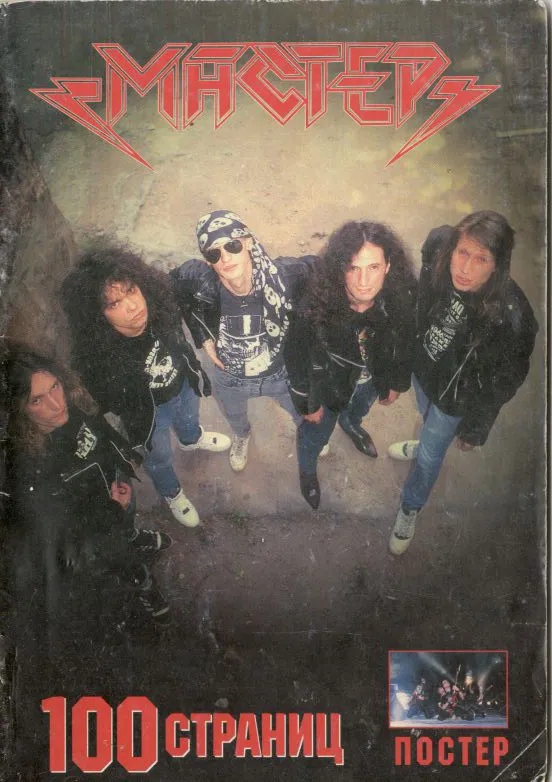

# Владимир Марочкин — «Мастер. 100 страниц»

Реконструкция и цифровое переиздание книги 2003 года об истории легендарной группы **«Мастер»**.

### 📖 О книге
Книга охватывает «золотой» период группы, начиная с ухода музыкантов из «Арии» в 1986 году, заканчивая началом 2000-х. В тексте подробно описаны записи альбомов, зарубежные гастроли и смены составов.

> *«Рок-энциклопедии датируют рождение группы «Мастер» осенью 1986 года... На самом деле всё началось гораздо раньше...»*

### 🛠 Особенности этого издания
- **Формат:** Свёрстано в современной системе [Typst](https://typst.app/).
- **Контент:** Полный текст книги, оригинальные фотографии и генеалогическое древо группы.
- **Качество:** Векторная вёрстка, оптимизированный размер PDF.

### 📥 Читать книгу
Вы можете скачать самую свежую сборку в формате PDF по ссылке ниже:

👉 **[Перейти к последнему выпуску (Скачать PDF)](https://github.com/vdistortion/master-metal-history/releases/latest)**

---
*Проект создан для сохранения истории отечественной тяжёлой музыки.*
